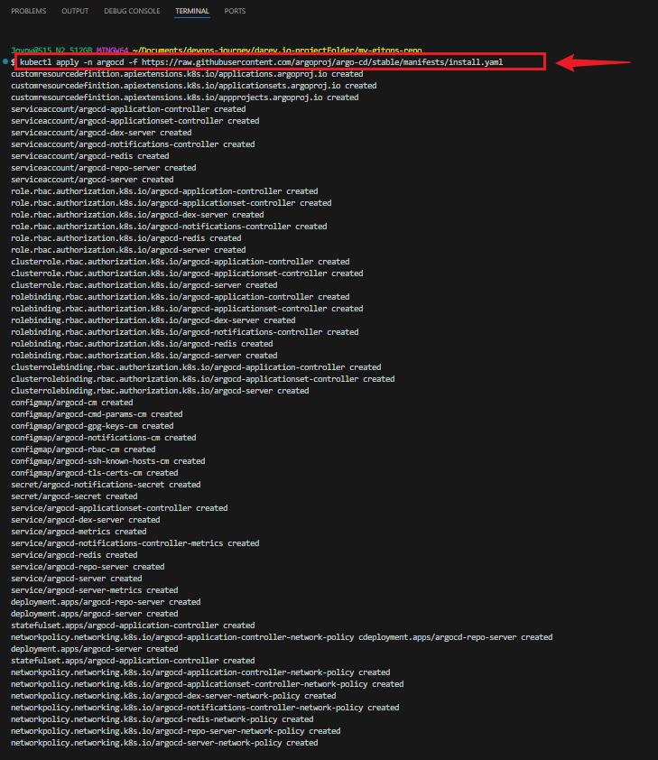
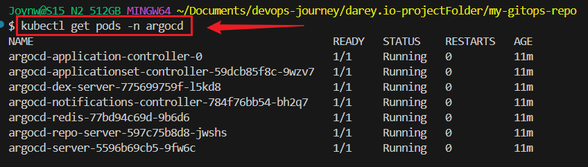
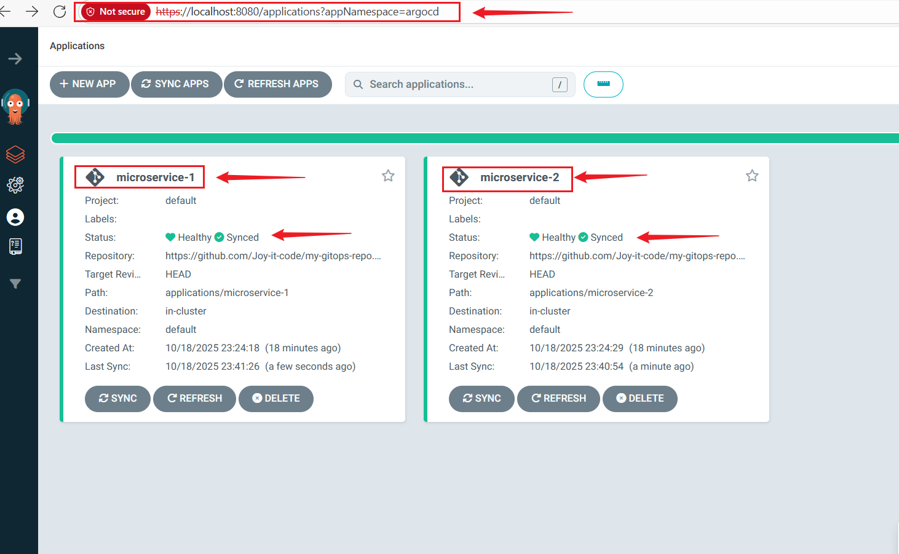
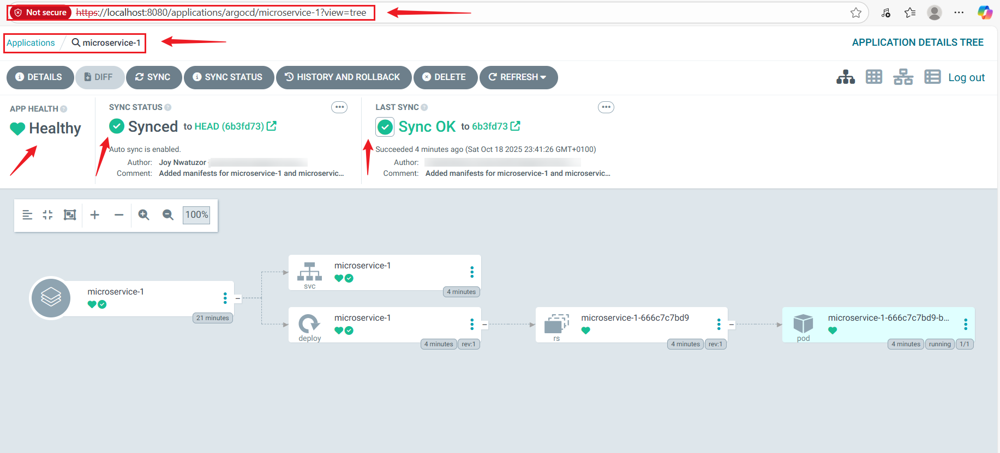
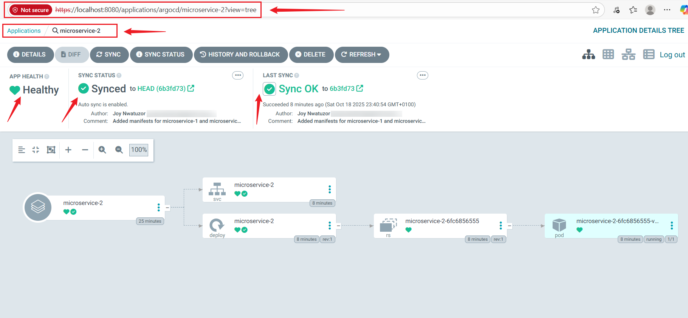
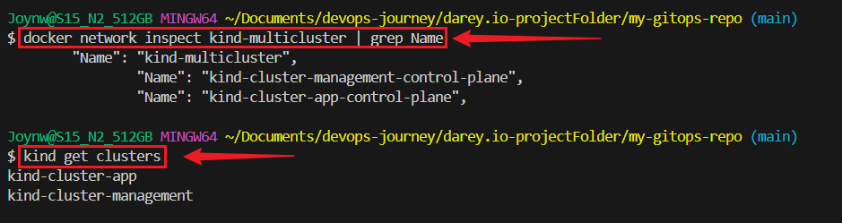
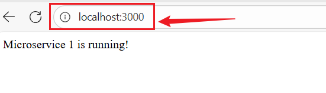
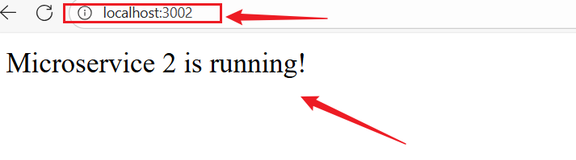

# ArgoCD GitOps Project

## Overview

GitOps is a modern approach to Continuous Deployment (CD) where Git serves as the **single source of truth** for both application and infrastructure definitions.

In this project:
- I used **Kind** to create two local Kubernetes clusters:
  - A **Management Cluster** hosting ArgoCD.
  - An **Application Cluster** hosting the deployed microservices.
- I used **ArgoCD** to automatically synchronize deployments from a Git repository.
- I containerized and deploy two sample microservices (e.g., `service-1` and `service-2`) built with Node.js.


## Architecture Overview

```bash
+------------------------+
| GitHub Repository |
| (Source of Truth) |
+------------------------+
|
| (git push triggers CI)
v
+------------------------+
| GitHub Actions CI/CD |
| - Build Docker images |
| - Update manifests |
+------------------------+
|
| (auto-sync)
v
+-----------------------------+
| ArgoCD Server |
| (on management cluster) |
+-----------------------------+
|
| manages apps
v
+-----------------------------+
| App Cluster(s) |
| (Kubernetes Workloads) |
+-----------------------------+
```

## Prerequisites

- A computer with WSL2 and Ubuntu installed.

- Docker Desktop (with WSL integration enabled).

- GitHub Account (for hosting repo and using Actions).

- Docker Hub Account (or alternative image registry).


## Setup Steps

1. Environment Setup

- Install dependencies inside WSL Ubuntu & Verify Other Installations:

```bash
docker --version
kind --version
kubectl version --client
argocd version --client
git --version
```

### Installed tools:

- **kubectl** for cluster management.

- **kind** to create local Kubernetes clusters.

- **argocd** CLI for ArgoCD control.

- **yq and jq** for YAML/JSON processing.


## 2. Create a single Kind cluster

### 2.1: Create a Kind config file:
```bash
cat <<EOF > kind-config.yaml
kind: Cluster
apiVersion: kind.x-k8s.io/v1alpha4
nodes:
  - role: control-plane
EOF
```


### Create the cluster:

```bash
kind create cluster --name kind-cluster-management --config kind-config.yaml
```

### Verify nodes:
```bash
kubectl get nodes
```

### Check contexts
```bash
kubectl config get-contexts
```


## Install ArgoCD

- Create ArgoCD namespace:
```bash
kubectl create namespace argocd
```

- Install ArgoCD manifests:
```bash
kubectl apply -n argocd -f https://raw.githubusercontent.com/argoproj/argo-cd/stable/manifests/install.yaml
```



- Verify pods:
```bash
kubectl get pods -n argocd
```



### Port-forward ArgoCD API
```bash
kubectl -n argocd port-forward svc/argocd-server 8080:443
```
**Access via browser at `https://localhost:8080`**


### Login with ArgoCD CLI

## Get initial password
```bash
kubectl -n argocd get secret argocd-initial-admin-secret -o jsonpath="{.data.password}" | base64 --decode
argocd login localhost:8080 --username admin --password <PASTE_PASSWORD_HERE> --insecure
```

### Change password:
```bash
argocd account update-password --current-password <OLD_PASSWORD> --new-password <NEW_PASSWORD>
```


## 3: Prepare Git repository structure for microservices

- Create folders:

```bash
mkdir -p applications/microservice-1       
mkdir -p applications/microservice-2
```

Each microservice will have:

- deployment.yaml

- service.yaml


### Add manifests for microservice-1:

```bash
cat <<EOF > applications/microservice-1/deployment.yaml
apiVersion: apps/v1
kind: Deployment
metadata:
  name: microservice-1
  labels:
    app: microservice-1
spec:
  replicas: 1
  selector:
    matchLabels:
      app: microservice-1
  template:
    metadata:
      labels:
        app: microservice-1
    spec:
      containers:
        - name: microservice-1
          image: nginx:latest
          ports:
            - containerPort: 80
EOF

cat <<EOF > applications/microservice-1/service.yaml
apiVersion: v1
kind: Service
metadata:
  name: microservice-1
spec:
  selector:
    app: microservice-1
  ports:
    - port: 80
      targetPort: 80
      protocol: TCP
EOF
```

### Add manifests for microservice-2:

```bash
cat <<EOF > applications/microservice-2/deployment.yaml
apiVersion: apps/v1
kind: Deployment
metadata:
  name: microservice-2
  labels:
    app: microservice-2
spec:
  replicas: 1
  selector:
    matchLabels:
      app: microservice-2
  template:
    metadata:
      labels:
        app: microservice-2
    spec:
      containers:
        - name: microservice-2
          image: httpd:latest
          ports:
            - containerPort: 80
EOF

cat <<EOF > applications/microservice-2/service.yaml
apiVersion: v1
kind: Service
metadata:
  name: microservice-2
spec:
  selector:
    app: microservice-2
  ports:
    - port: 80
      targetPort: 80
      protocol: TCP
EOF
```


## 4: Create ArgoCD Applications

- Create a YAML for each microservice, e.g., microservice-1-app.yaml:

```bash
apiVersion: argoproj.io/v1alpha1
kind: Application
metadata:
  name: microservice-1
  namespace: argocd
spec:
  project: default
  source:
    repoURL: 'https://github.com/<YOUR_USERNAME>/my-gitops-repo.git'
    targetRevision: HEAD
    path: applications/microservice-1
  destination:
    server: https://kubernetes.default.svc
    namespace: default
  syncPolicy:
    automated:
      prune: true
      selfHeal: true
```


## Apply in the cluster:
```bash
kubectl apply -f microservice-1-app.yaml -n argocd
kubectl apply -f microservice-2-app.yaml -n argocd
```





## Multi-Cluster Deployment Validation

- Edit the destination in microservice-2-app.yaml
```bash
name: kind-cluster-app
```

### Apply it again:
```bash
kubectl apply -f microservice-2-app.yaml -n argocd
```

### Sync to confirm deployment:
```bash
argocd app sync microservice-2
```

### Verify it’s targeting the second cluster:

```bash
argocd app list
```


### Create the cluster config files

- kind-config-management.yaml
```bash
kind: Cluster
apiVersion: kind.x-k8s.io/v1alpha4
name: kind-cluster-management
networking:
  apiServerAddress: "0.0.0.0"
  apiServerPort: 6445
  disableDefaultCNI: false
nodes:
  - role: control-plane
    extraPortMappings:
      - containerPort: 80
        hostPort: 8081
        protocol: TCP
    kubeadmConfigPatches:
      - |
        kind: ClusterConfiguration
        networking:
          serviceSubnet: "10.96.0.0/12"
```


- kind-config-app.yaml
```bash
kind: Cluster
apiVersion: kind.x-k8s.io/v1alpha4
name: kind-cluster-app
networking:
  apiServerAddress: "0.0.0.0"
  apiServerPort: 6446
  disableDefaultCNI: false
nodes:
  - role: control-plane
    extraPortMappings:
      - containerPort: 80
        hostPort: 8082
        protocol: TCP
    kubeadmConfigPatches:
      - |
        kind: ClusterConfiguration
        networking:
          serviceSubnet: "10.97.0.0/12"
```


### Create both clusters
```bash
kind create cluster --name kind-cluster-management --config kind-config-management.yaml --image kindest/node:v1.29.2
kind create cluster --name kind-cluster-app --config kind-config-app.yaml --image kindest/node:v1.29.2
```

### Confirm:
```bash
kind-multicluster | grep Name
kind get clusters
docker network inspect 
```



###  Merge kubeconfigs
```bash
KUBECONFIG=~/.kube/config:~/.kube/kind-cluster-management.yaml:~/.kube/kind-cluster-app.yaml kubectl config view --flatten > /tmp/config && mv /tmp/config ~/.kube/config
```

### Verify:
```bash
kubectl config get-contexts
```

### Register the app cluster in ArgoCD
```bash
argocd login localhost:8080 --username admin --password <your-password> --insecure
argocd cluster add kind-kind-cluster-app
```


### Use kubectl exec with a test pod & management cluster:

```bash
kubectl --context kind-kind-cluster-app run test-app --image=nginx --restart=Never --port=80
kubectl --context kind-kind-cluster-management run test-mgmt --image=busybox --restart=Never -- sleep 3600
```

### Get the Pod IP of the app pod:
```bash
kubectl --context kind-kind-cluster-app get pod -o wide
```


### Connect both clusters to your shared network:
```bash
docker network connect kind-multicluster kind-cluster-management-control-plane
docker network connect kind-multicluster kind-cluster-app-control-plane
```

### Verify Connection:
```bash
docker inspect kind-cluster-management-control-plane | grep kind-multicluster
docker inspect kind-cluster-app-control-plane | grep kind-multicluster
```


### Test access
```bash
curl -k https://localhost:6446/version
```


### Register the app cluster in ArgoCD
```bash
kubectl config set-cluster kind-kind-cluster-app --server=https://localhost:6446
argocd cluster add kind-kind-cluster-app
argocd cluster list
```


### Install ArgoCD in the management cluster
```bash
kubectl --context kind-kind-cluster-management create namespace argocd
kubectl --context kind-kind-cluster-management apply -n argocd -f https://raw.githubusercontent.com/argoproj/argo-cd/stable/manifests/install.yaml
```
**Open https://localhost:8080**

### Check Pods
```bash
kubectl --context kind-kind-cluster-management get pods -n argocd -w
```

### Port-forward to access the ArgoCD UI
```bash
kubectl --context kind-kind-cluster-management -n argocd port-forward svc/argocd-server 8080:443
```
**Open `https://localhost:8080`**


### Log in to ArgoCD CLI

- In a new terminal, run:
```bash
argocd login localhost:8080 --username admin --password $(kubectl --context kind-kind-cluster-management -n argocd get secret argocd-initial-admin-secret -o jsonpath="{.data.password}" | base64 -d)
```

### Register your app cluster again
```bash
argocd cluster add kind-kind-cluster-app
```


### Find IP & Update the kubeconfig entry for your app cluster:
```bash
docker inspect -f '{{range .NetworkSettings.Networks}}{{.IPAddress}}{{end}}' kind-cluster-app-control-plane
kubectl config set-cluster kind-kind-cluster-app --server=https://172.*.*.*:6443
```


### Get your kubeconfig for the app cluster
```bash
kind get kubeconfig --name kind-cluster-app > app-kubeconfig.yaml
```

### Copy that file into ArgoCD pod
```bash
kubectl get pods -n argocd
kubectl cp app-kubeconfig.yaml argocd/argocd-repo-server-xxxxx:/tmp/app-kubeconfig.yaml
```

### Use PowerShell
```bash
kubectl cp app-kubeconfig.yaml argocd/argocd-repo-server-597c75b8d8-gbvqv:/tmp/app-kubeconfig.yaml -n argocd
```

### On Windows Run

```bash
kubectl exec -it argocd-repo-server-597c75b8d8-gbvqv -n argocd -- sh
sed -i 's|https://127.0.0.1:6446|https://172.18.0.8:6443|' /tmp/app-kubeconfig.yaml
grep server /tmp/app-kubeconfig.yaml
argocd cluster add kind-kind-cluster-app --kubeconfig /tmp/app-kubeconfig.yaml --name kind-cluster-app --insecure
```

## Step 5: Integrate CI/CD

### Create .github/workflows/build-and-deploy.yaml add:

```bash

      - 'applications/**'
```


### Initialize the App
```bash
npm init -y
npm install express
```

### Create index.js
```bash
// index.js
const express = require('express');
const app = express();
const port = 3000;

app.get('/', (req, res) => {
  res.send('Microservice 1 is running!');
});

app.listen(port, () => {
  console.log(`Microservice 1 listening at http://localhost:${port}`);
});
```

### Dockerfile
```bash
FROM node:20-alpine
WORKDIR /app
COPY package*.json ./
RUN npm install
COPY . .
EXPOSE 3000
CMD ["node", "index.js"]
```


### Build and Test Locally
```bash
docker build -t username/microservice-1:latest .
docker run -p 3000:3000 username/microservice-1:latest
```
**Then visit `http://localhost:3000`**



### Log In to Docker Hub
```bash
docker login
```

### Tag and for Docker Hub Push
```bash
docker images
docker tag username/microservice-1:latest username/microservice-1:latest .
docker run -p 3001:3000 username/microservice-2:latest
docker push username/microservice-1:latest
```
**visit:`http://localhost:3001`**
**Repeat for microservice 2**



### Cleanup

#### Delete all clusters
```bash
kind delete cluster --name kind-cluster-app
kind delete cluster --name kind-cluster-management
for cluster in $(kind get clusters); do kind delete cluster --name $cluster; done
docker volume prune -f
```


### Verify cleanup
```bash
kind get clusters
docker ps
docker network ls | grep kind
```


### Challenges and Solutions


| **Challenge** | **Description** | **Solution** |
|----------------|-----------------|---------------|
| Cluster Connection Issues | `argocd cluster add` failed due to wrong localhost mapping. | Updated kubeconfig to use the correct IP and ports (e.g., `127.0.0.1:6446`). |
| TLS Certificate Error | Kind cluster certificates were not valid for external IPs. | Used `0.0.0.0` or regenerated cluster with matching IP. |
| ArgoCD Access Problems | UI inaccessible on Windows Git Bash. | Used port forwarding and accessed via browser at [`https://localhost:8080`](https://localhost:8080). |
| Leaked Secret Detected by GitGuardian | An accidental Base64-encoded key was pushed. | Rotated keys, scrubbed repo history using **BFG Repo-Cleaner**, and re-pushed clean state. |
| Microservices Duplication | Two instances created by Kind config. | Rechecked Kind YAMLs and removed duplicate worker definitions. |


### Lessons Learned

Always validate cluster contexts and kubeconfigs before linking ArgoCD.

Keep secrets out of Git — use Kubernetes secrets or GitOps vault integrations.

Declarative infrastructure helps trace every change through Git.

ArgoCD’s visual dashboard simplifies debugging and sync operations.


### Conclusion

This project successfully demonstrates a complete GitOps workflow with local clusters using Kind, automated deployments with ArgoCD, and containerized Node.js microservices.
It reinforces the importance of automation, reproducibility, and version control in modern DevOps practices.

By integrating ArgoCD with Kind, I achieve a lightweight yet powerful environment for experimenting with Continuous Deployment, infrastructure as code, and multi-cluster orchestration, all reproducible from Git.


### Author

#### Joy Nwatuzor

- **Github:** Joy-it-code

- **DevOps Engineer in training** — mastering GitOps, ArgoCD, Kubernetes & automation.